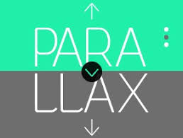
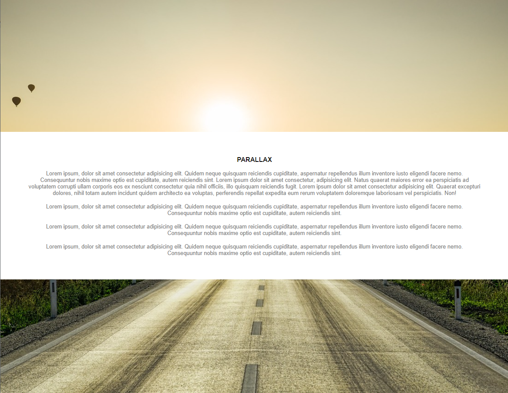
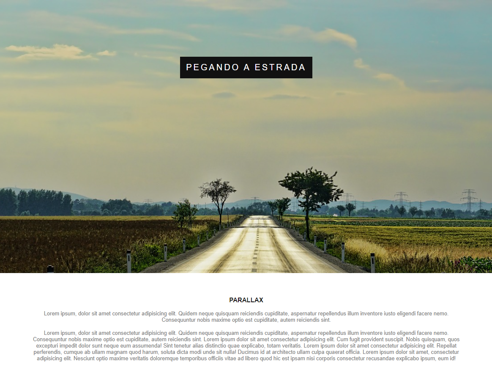

# Página Parallax
## Página criada utilizando a aplicação de parallax, explorando e aprofundando o conceito no desenvolvimento web.
<h1 align="center">
  
</h1>

 <a href="#sobre-o-projeto">Sobre</a> •
 <a href="#funcionalidades">Funcionalidades</a> •
 <a href="#layout">Layout</a> • 
 <a href="#tecnologias">Tecnologias</a> • 

<h4 align="center"> 
	 Projeto Parallax Finalizado
</h4>

## Sobre o projeto

   A página criada com parallax foi um projeto desenvolvido durante o curso de Desenvolvimento Web ministrado pelo professor Jamilton Damasceno

Esse projeto foi desenvolvido para o estudo de implementação de conceitos básicos e boas práticas adotados na criação de páginas web abordando especialmente o efeito parallax. 
Sendo na computação gráfica, o efeito Parallax costuma ser simulado com a técnica de mover imagens de fundo em uma velocidade mais lenta do que as imagens de primeiro plano, criando 
no nosso cérebro a ilusão de profundidade em planos 2D.

Na web é usado na maioria das vezes em sites de uma única página, que envolve o fundo se movendo em um ritmo mais lento em primeiro plano, criando um efeito 3D quando você rolar 
a página. Ou seja, o parallax é uma técnica que causa uma ilusão de profundidade nas interfaces.
---

## ⚙Funcionalidades

-Basicamente o projeto consiste de apenas uma página principai pois o fim é apenas didático e introdutório no html e css, sendo essas páginas o index.

  Página Index:
  
  Nesta página foi contruida variando em um efeito parallax e um texto.
  
  
  
  
  
  
  
  
  ---

## 🎨Layout

O layout foi fornecido pelo professor 
[Jamilton Damasceno](https://www.linkedin.com/in/jamiltondamasceno/).

### 🛠Tecnologias

As seguintes ferramentas foram usadas na construção do projeto:

- [HTML](https://www.w3schools.com/html/default.asp)
- [CSS](https://www.w3schools.com/css/)
- [VisualStudio](https://visualstudio.microsoft.com/pt-br/)
